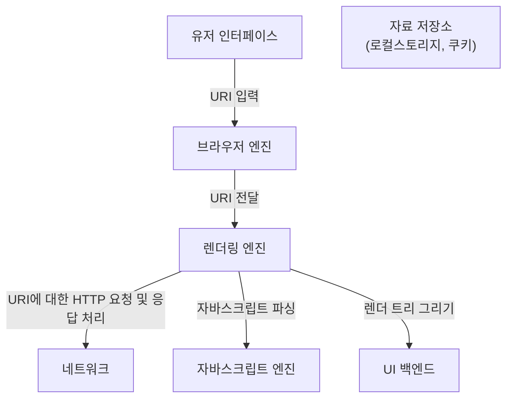
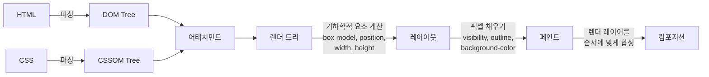
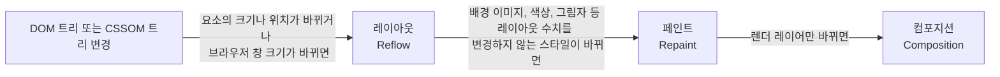

## 목표

브라우저가 웹 페이지를 어떻게 그리는지 설명하고, 그에 따라 어떻게 해야 브라우저 렌더링을 최적화할 수 있는지 정리합니다.

<!--end-of-description-->

## 브라우저 구조

## 브라우저 렌더링 시나리오

1. `유저 인터페이스`: 사용자가 `유저 인터페이스`에 있는 주시표시줄에 URI를 입력합니다.
2. `브라우저 엔진`: 브라우저 엔진은 URI에 해당하는 자료를 `네트워크`에 요청하기 전에 `자료 저장소`에 캐시되어 있는지 찾고, 있다면 해당 자료를 URI와 함께 `렌더링 엔진`에 전달합니다.
3. `렌더링 엔진`: `렌더링 엔진`은 사용자가 입력한 URI에 해당하는 자료를 `네트워크`에 요청하고, 응답으로 HTML, CSS, JS 리소스를 받아옵니다. HTML과 CSS는 `렌더링 엔진`에서 직접 파싱하고 JS 파일은 [크롬의 V8](https://github.com/v8/v8) 같은 `자바스크립트 엔진`으로 파싱합니다. 파싱 결과물인 DOM 트리를 렌더 트리로 바꿉니다. 렌더 트리를 `UI 백엔드`에 전달하고 `UI 백엔드`의 도움으로 화면을 그립니다.

## 렌더링 과정

HTML, CSS, JS 파일을 받아서 화면에 픽셀로 그리는 단계를 주요 렌더링 경로(Critical Rendering Path, CRP)라고 부르며 다음과 같은 과정을 거칩니다:

1. `어태치먼트`: HTML과 CSS를 파싱하여 렌더 트리를 구축합니다.
2. `렌더 트리`: 렌더 트리에는 화면에 그릴 요소만 포함됩니다. 가령, `display: none` 속성을 가진 노드는 렌더 트리에 포함되지 않습니다.
3. `레이아웃`: 렌더 트리에 있는 각 노드를 화면 어디에 배치할지 정확한 위치와 크기 같은 기하학적 속성을 계산합니다. 웹킷(webkit)에서는 레이아웃(Layout)이라고 부르고 Gecko에서는 리플로우(Reflow)라고 부릅니다.
4. `페인트`: 배치가 끝나면 렌더 트리를 순회하면서 개별 노드에 대한 픽셀을 채웁니다. 페인트 과정은 일반적으로 페인팅 영역을 나눠서 다수의 레이어에서 수행합니다. 리페인트(Repaint)라고도 부릅니다.
5. `컴포지션`: 여러 레이어 중에서 어떤 순서부터 그려야 할지 고려하여 최종적으로 합성합니다.

## 주요 렌더링 과정 최적화

DOM 트리나 CSSOM 트리가 변경되면 렌더링을 다시 해야 하므로 레이아웃과 페인트 과정을 반복해야 합니다. 이러한 레이아웃이나 페인트는 모두 브라우저의 연산에 포함되고 웹 성능과 직결됩니다. 레이아웃이나 페인트 과정을 최소화하는 프로세스를 주요 렌더링 과정 최적화라고 부릅니다.

결론적으로, 레이아웃과 페인트를 모두 피하고 레이어만 변경하는 컴포지션을 유도하면 최고의 성능을 얻을 수 있습니다. 그리고 그러한 속성으로는 `transform`과 `opacity`가 있습니다. 따라서 예를 들면:

- 요소를 이동해야 할 때 레이아웃을 다시 계산 해야 하는 `left: 30px` 속성이 아니라 `transform: translateX(30px)` 속성을 사용합니다.
- 요소를 보여주거나 숨겨야 할 때 레이아웃을 다시 계산해야 하는 `visibility` 속성이 아니라 `opacity`를 사용합니다.

## See also

- [Google Developers - 렌더링 성능](https://developers.google.com/web/fundamentals/performance/rendering?hl=ko): 주요 렌더링 경로의 각 파이프 라인 설명
- [Google Developers - 렌더링 트리 생성, 레이아웃 및 페인트](https://developers.google.com/web/fundamentals/performance/critical-rendering-path/render-tree-construction?hl=ko): 주요 렌더링 과정에 대한 흐름 설명
- [이소정 - 브라우저 동작원리](https://present.do/presentations/6187b87b8eb0d57ea69fd5ac?page=25)
- [CSS Triggers - transform](https://csstriggers.com/transform): 주요 렌더링 과정과 관련된 CSS 속성 정리
- [James Priest's Study Notes - Browser Rendering Optimization](https://james-priest.github.io/udacity-nanodegree-mws/course-notes/browser-rendering-optimization.html)
- Youtube - Browser rendering process
  - [1편 - Browser 구성 요소](https://www.youtube.com/watch?v=oLC_QYPmtS0)
  - [2편 - 렌더링 엔진 동작과정](https://www.youtube.com/watch?v=EBe-OHkf9w8)
  - [3편 - Browser rendering optimization](https://www.youtube.com/watch?v=G4eQziVzCTE)
- [Naver D2 - 브라우저는 어떻게 동작하는가?](https://d2.naver.com/helloworld/59361)
- [소소 - 브라우저는 웹페이지를 어떻게 그리나요? - Critical Rendering Path](https://m.post.naver.com/viewer/postView.nhn?volumeNo=8431285&memberNo=34176766)
- [Youtube - [10분 테코톡] 체프의 브라우저 렌더링](https://www.youtube.com/watch?v=sJ14cWjrNis)
