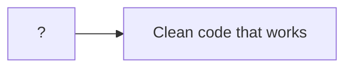
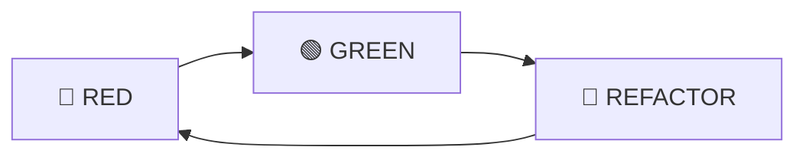

## 💁 프롤로그

> 시리즈 "[화폐 예제 실습으로 TDD의 리듬 느껴보기](/tags/tdd-by-example/)"에서 사용되는 공통 프롤로그입니다.



어떻게 하면 작동하는 깔끔한 코드(clean code that works)를 얻을 수 있을까요? 켄트 벡(Kent Beck)은 자동화된 테스트로 개발을 이끌어 가는 테스트 주도 개발(TDD, Test Driven Development)을 제안합니다. 과연 TDD를 하면 작동하는 깔끔한 코드를 얻을 수 있는지, 어떤 이유로 그러한지 궁금하네요. 책 [테스트 주도 개발(Test Driven Development: By Example)](http://www.yes24.com/Product/Goods/12246033)을 읽고 실습한 내용을 정리합니다.

<!--end-of-description-->

- [실습 코드](https://github.com/datalater/tdd-example-currency/)
- [회고]()

### TDD 시작하기

TDD는 두 가지 규칙을 따릅니다:

1. 오직 자동화된 테스트가 실패할 경우에만 새로운 코드를 작성한다.
2. 중복을 제거한다.

위 규칙에 의해 TDD로 코드를 짜는 순서는 다음과 같이 결정됩니다.

1. 레드(RED) - 실패하는 작은 테스트를 작성한다. 처음에는 컴파일조차 되지 않을 수 있다.
2. 그린(GREEN) - 빨리 테스트가 통과하게끔 만든다. 이를 위해 어떤 죄악을 저질러도 좋다.
3. 리팩토링(REFACTOR) - 일단 테스트를 통과하게만 하는 와중에 생겨난 모든 중복을 제거한다.

> 죄악이란 기존 코드 복사해서 붙이기(copy and paste), 테스트만 간신히 통과할 수 있게끔 함수가 무조건 특정 상수를 반환하도록 구현하기 등을 의미한다.



> 리팩토링(Refactoring)이란 코드의 외적 행위는 그대로 유지하면서 내부 구조를 변경하는 작업을 뜻한다.

### 화폐 예제의 목표

화폐 예제를 실습하면서 가져야 할 목표는 TDD의 리듬을 느껴보는 것입니다.

> 내 목표는 여러분이 테스트 주도 개발(TDD)의 리듬을 보도록 하는 것이다. 그 리듬은 다음과 같이 요약할 수 있다.
>
> 1. 재빨리 테스트를 하나 추가한다.
> 2. 모든 테스트를 실행하고 새로 추가한 것이 실패하는지 확인한다.
> 3. 코드를 조금 바꾼다.
> 4. 모든 테스트를 실행하고 전부 성공하는지 확인한다.
> 5. 리팩토링을 통해 중복을 제거한다.
>
> 아마 당신은 다음과 같은 것에 대해 놀랄 것이다.
>
> - 각각의 테스트가 기능의 작은 증가분을 어떻게 커버하는지
> - 새 테스트를 돌아가게 하기 위해 얼마나 작고 못생긴 변화가 가능한지
> - 얼마나 자주 테스트를 실행하는지
> - 얼마나 수없이 작은 단계를 통해 리팩토링이 되어가는지 [^1]

> 이 예제를 통해 여러분은 코딩하기 전에 먼저 테스트를 만드는 법과 설계를 유기적으로 키워나가는(grow) 방법을 배우게 될 것이다. [^2]

### 화폐 예제 요구사항

`AS-IS`에서 `TO-BE`로 변경하는 것이 화폐 예제의 요구사항입니다.

- `AS-IS`
  - 다음과 같은 보고서가 있다.

| 종목 |   주 | 가격 |  합계 |
| :--: | ---: | ---: | ----: |
| IBM  | 1000 |   25 |  2500 |
|  GE  |  400 |  100 | 40000 |
|      |      | 합계 | 65000 |

- `TO-BE`
  - 다중 통화를 지원하는 보고서를 만들어야 한다.
  - 환율을 명시해야 한다.

| 종목 |   주 |   가격 |     합계 |
| :--: | ---: | -----: | -------: |
| IBM  | 1000 |  25USD |  2500USD |
|  GE  |  400 | 100CHF | 40000CHF |
|      |      |   합계 | 65000USD |

| 기준 | 변환 | 환율 |
| :--: | ---: | ---: |
| CHF  |  USD |  1.5 |

### 할일 목록 읽는 법

<!-- prettier-ignore-start -->
```diff
  $5 + 10CHF = $10(환율이 2:1일 경우)
+ $5 * 2 = $10
  amount를 private으로 만들기
- Dollar 부작용(side effect)?
  Money 반올림?
```
{: file="할일목록" }
<!-- prettier-ignore-end -->

- 일반: 작업해야 할 항목
- 빨강: 현재 작업을 시작한 항목
- 초록: 작업을 끝낸 항목

---

## 🎬 1장 다중 통화를 지원하는 Money 객체 [^3]

### 어떤 테스트들이 있어야 코드가 완성됐다는 걸 확신할 수 있을까

새로운 보고서를 생성하기 위해 어떤 기능이 필요할까요? 이 질문을 "어떤 테스트가 있어야 코드가 완성됐다는 걸 확신할 수 있을까?"로 바꿔서 생각합니다.


- 통화가 다른 두 금액을 더해서 주어진 환율에 맞게 변한 금액을 결과로 얻을 수 있어야 한다.
- 어떤 금액을 어떤 개수에 곱한 금액을 결과로 얻을 수 있어야 한다.

그리고 할일 목록을 작성합니다.

> 앞으로 어떤 일을 해야 하는지 알려주고, 지금 하는 일에 집중할 수 있도록 도와주며, 언제 일이 다 끝나는지 알려줄 수 있게끔 할일 목록을 작성해보자. 앞으로 할일 목록에 있는 한 항목에 대한 작업을 시작하면 **이런 식으로** 굵은 글씨체로 나타낼 것이다. 작업을 끝낸 항목에는 ~~이런 식으로~~ 줄을 긋도록 하자. 또다른 테스트가 생각나면 할일 목록에 새로운 항목을 추가할 것이다.

<!-- prettier-ignore-start -->
```diff
  $5 + 10CHF = $10(환율이 2:1일 경우)
  $5 * 2 = $10
```
{: file="할일목록" }
<!-- prettier-ignore-end -->

작고 간단한 테스트부터 작성합니다.

> 할일 목록을 보니 첫 번째 테스트는 좀 복잡해 보인다. 작은 것부터 시작하든지, 아니면 아예 손대지 않는 게 좋다. 이번엔 다음 항목인 곱하기를 보자. 대단히 어렵진 않겠지? 이걸 먼저 하는 게 좋겠다.

<!-- prettier-ignore-start -->
```diff
  $5 + 10CHF = $10(환율이 2:1일 경우)
- $5 * 2 = $10
```
{: file="할일목록" }
<!-- prettier-ignore-end -->

작성의 편의를 위해 작업을 시작한 항목을 빨간색으로 나타내고, 작업을 끝낸 항목은 녹색으로 나타내겠습니다.

<!-- prettier-ignore-start -->
```ts
test("곱하기", () => {
  const five: Dollar = new Dollar(5);
  five.times(2);
  expect(five.amount).toBe(10);
});
```
{: file="app.test.ts" }
<!-- prettier-ignore-end -->

재빨리 테스트를 추가했는데 문제점이 있습니다. 문제점을 할일 목록에 적어 놓습니다.

> 그래, 나도 안다. 공용 필드(public field)에다가, 예기치 못한 부작용이 있을 수도 있고, 금액을 계산하는 데 정수형을 사용한다. 하지만 작은 단계로 시작하는 것뿐이다. 이런 문제들을 적어 놓고 계속 진행하자. 지금 우리에겐 실패하는 테스트가 주어진 상태고 최대한 빨리 초록 막대를 보고 싶을 뿐이다.

<!-- prettier-ignore-start -->
```diff
  $5 + 10CHF = $10(환율이 2:1일 경우)
- $5 * 2 = $10
  amount를 private으로 만들기
  Dollar 부작용(side effect)?
  Money 반올림?
```
{: file="할일목록" }
<!-- prettier-ignore-end -->

방금 우리가 작성한 테스트는 아직 컴파일조차 되지 않습니다.

- Dollar 클래스 없음
- 생성자 없음
- times(number) 메서드 없음
- amount 필드 없음

한 번에 하나씩 정복합니다. 컴파일만 되게 할 거니까 "최소한"의 코드만 작성합니다.

```ts
// Dollar 클래스 정의
class Dollar {
  amount: number; // amount 필드 추가

  constructor(amount) {} // 생성자 정의

  times(multiplier: number) {} // 스텁 구현
}

test("곱하기", () => {
  const five: Dollar = new Dollar(5);
  five.times(2);
  expect(five.amount).toBe(10);
});
```

<details>
<summary><strong>스텁 구현</strong></summary>

<blockquote>스텁 구현은 메서드의 서명부와 (반환값이 있을 경우) 반환 명령만 적는 식으로 해서, 이 메서드를 호출하는 코드가 컴파일 될 수 있도록 껍데기만 만들어두는 것을 뜻한다.</blockquote>

</details>

이제 테스트가 실패하는 모습(RED)을 볼 수 있게 됐습니다!

```console
Expected: 10
Received: 5
```

> 이것도 일종의 진척이다. 이제 실패에 대한 구체적인 척도를 갖게 된 것이다. 막연히 실패했다는 사실만 아는 것보다 나아진 것이다. 우리 문제는 '다중 통화 구현'에서 '이 테스트를 통과시킨 후 나머지 테스트들도 통과시키기'로 변형된 것이다. 훨씬 간단하다. 범위도 훨씬 적어서 걱정이 줄었다. 이 테스트를 통과시키는 건 쉽다.

테스트를 통과(GREEN)시키기 위한 "최소" 작업을 합니다.

```ts
class Dollar {
  amount: number = 10; // here

  constructor(amount) {}

  times(multiplier: number) {}
}

test("곱하기", () => {
  const five: Dollar = new Dollar(5);
  five.times(2);
  expect(five.amount).toBe(10);
});
```

테스트가 통과(GREEN)되었습니다!

> 계속 진행하기 전에 일반화해야 한다. 주기는 다음과 같다. 잊지 말 것.
>
> 1. 작은 테스트를 하나 추가한다.
> 2. 모든 테스트를 실행해서 테스트가 실패하는 것을 확인한다.
> 3. 조금 수정한다.
> 4. 모든 테스트를 실행해서 테스트가 성공하는 것을 확인한다.
> 5. 중복을 제거하기 위해 리팩토링을 한다.

지금까지 주기의 1번부터 4번까지 진행했습니다.

> 이제 중복을 제거할 차례다. 그런데 어디가 중복이란 말인가? 보통 여러분은 중복을 찾기 위해 코드를 비교할 것이다. 하지만 이번 경우엔 중복이 테스트에 있는 데이터와 코드에 있는 데이터 사이에 존재한다. 못 찾겠는가? 코드를 다음과 같이 썼다면 어땠을까?

```ts
class Dollar {
  amount: number = 5 * 2;
}
```

> 이제 5와 2가 두 곳에 존재한다. 따라서 우린 무자비하게 이 중복을 제거해야 한다. 규칙이 그러니까.
> 5와 2를 한 번에 제거할 수 있는 방법은 없다. 하지만 객체의 초기화 단계에 있는 설정 코드를 times() 메서드 안으로 옮겨보면 어떨까?

```ts
class Dollar {
  amount: number;

  constructor(amount) {}

  times(multiplier: number) {
    this.amount = 5 * 2; // here
  }
}
```

테스트는 여전히 통과(GREEN)합니다.

> 이 단계가 너무 작게 느껴지는가? 하지만 기억하기 바란다. TDD의 핵심은 이런 작은 단계를 밟아야 한다는 것이 아니라, 이런 작은 단계를 밟을 능력을 갖추어야 한다는 것이다. (...) 여러분이 직접 예제를 선택하여 작은 단계로 구현하는 연습을 해보기 바란다. 만약 정말 작은 단계로 작업하는 방법을 배우면, 저절로 적절한 크기의 단계로 작업할 수 있게 될 것이다.

5를 어디서 얻을 수 있을까요? 이건 생성자에서 넘어오는 값이니 다음과 같이 amount 변수에 저장하면,

```ts
class Dollar {
  constructor(amount) {
    this.amount = amount;
  }
}
```

times()에서 사용할 수 있습니다.

```ts
class Dollar {
  times(multiplier: number) {
    this.amount = this.amount * 2;
  }
}
```

인자 multiplier의 값이 2이므로, 상수를 이 인자로 대체합니다.

```ts
class Dollar {
  times(multiplier: number) {
    this.amount = this.amount * multiplier;
  }
}
```

중복을 제거하기 위해 `*=` 연산자를 써줍니다.

```ts
class Dollar {
  times(multiplier: number) {
    this.amount *= multiplier;
  }
}
```

이제 할일 목록에서 첫 번째 테스트에 완료 표시를 할 수 있게 되었습니다.

<!-- prettier-ignore-start -->
```diff
  $5 + 10CHF = $10(환율이 2:1일 경우)
+ $5 * 2 = $10
  amount를 private으로 만들기
  Dollar 부작용(side effect)?
  Money 반올림?
```
{: file="할일목록" }
<!-- prettier-ignore-end -->

### 정리

> 지금까지 한 작업을 검토해보자. 우리는 다음 작업들을 해냈다.
>
> - 우리가 알고 있는 작업해야 할 테스트 목록을 만들었다.
> - 오퍼레이션이 외부에서 어떻게 보이길 원하는지 말해주는 이야기를 코드로 표현했다.
> - 스텁 구현을 통해 테스트를 컴파일했다.
> - 끔찍한 죄악을 범하여 테스트를 통과시켰다.
> - 돌아가는 코드에서 상수를 변수로 변경하여 점진적으로 일반화했다.
> - 새로운 할일들을 한번에 처리하는 대신 할일 목록에 추가하고 넘어갔다.

<details>
<summary><strong>오퍼레이션</strong></summary>

<blockquote>오퍼레이션은 보통 메서드(method)와 비슷한 의미로 쓰이며 객체가 수행할 수 있는 연산을 의미한다. 엄격하게는 오퍼레이션에 대한 특정한 하나의 구현을 메서드라고 부른다. 언어가 다형성(polymorphism)을 지원할 경우 한 오퍼레이션은 여러 메서드를 가질 수 있다.</blockquote>

</details>

"처음부터 완벽한 코드를 짜자"라고 말하면 동의하는 개발자는 아마 찾아보기 힘들 겁니다. 이번 실습을 하면서, 완벽한 코드를 짜지 못하는 평범한 개발자가 어떻게 하면 TDD라는 개발 방법을 사용해서 차근차근 문제를 해결해나가는지 그 과정을 아주 구체적으로 엿볼 수 있었습니다.

가령, 테스트 코드를 실행하기 위해서 구현 코드를 모두 짜는 게 아니라 최소한의 작업인 컴파일 코드만 짜는 점, 작업을 하다가 새로운 작업 이슈가 생기면 작업을 새로운 작업까지 포함해서 작업을 하는 게 아니라 (할일 목록에 추가만 해두고) 기존 작업 크기를 유지하는 점이 그렇습니다.

## 📚 함께 읽기

- [테스트 주도 개발](http://www.yes24.com/Product/Goods/12246033)
- [실습 코드](https://github.com/datalater/tdd-example-currency/)
- [회고]()

## 🔖 주석

[^1]: 테스트 주도 개발. 1부. 38쪽.
[^2]: 테스트 주도 개발. 들어가는 글. 27쪽.
[^3]: 테스트 주도 개발. 1장. 41쪽.
