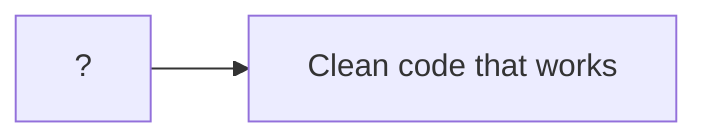
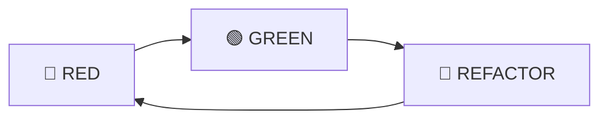
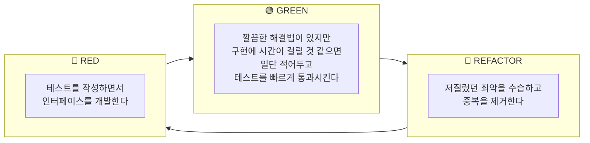
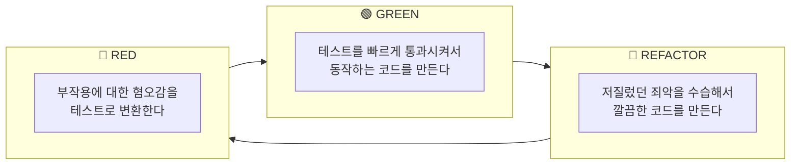

## 💁 프롤로그

> 시리즈 "[화폐 예제 실습으로 TDD의 리듬 느껴보기](/tags/tdd-by-example/)"에서 사용되는 공통 프롤로그입니다.



어떻게 하면 작동하는 깔끔한 코드(clean code that works)를 얻을 수 있을까요? 켄트 벡(Kent Beck)은 자동화된 테스트로 개발을 이끌어 가는 테스트 주도 개발(TDD, Test Driven Development)을 제안합니다. 과연 TDD를 하면 작동하는 깔끔한 코드를 얻을 수 있는지, 어떤 이유로 그러한지 궁금하네요. 책 [테스트 주도 개발(Test Driven Development: By Example)](http://www.yes24.com/Product/Goods/12246033)을 읽고 실습한 내용을 정리합니다.

<!--end-of-description-->

- [실습 코드](https://github.com/datalater/tdd-example-currency/)
- [회고]()

### TDD 시작하기

TDD는 두 가지 규칙을 따릅니다:

1. 오직 자동화된 테스트가 실패할 경우에만 새로운 코드를 작성한다.
2. 중복을 제거한다.

위 규칙에 의해 TDD로 코드를 짜는 순서는 다음과 같이 결정됩니다.

1. 레드(RED) - 실패하는 작은 테스트를 작성한다. 처음에는 컴파일조차 되지 않을 수 있다.
2. 그린(GREEN) - 빨리 테스트가 통과하게끔 만든다. 이를 위해 어떤 죄악을 저질러도 좋다.
3. 리팩토링(REFACTOR) - 일단 테스트를 통과하게만 하는 와중에 생겨난 모든 중복을 제거한다.

> 죄악이란 기존 코드 복사해서 붙이기(copy and paste), 테스트만 간신히 통과할 수 있게끔 함수가 무조건 특정 상수를 반환하도록 구현하기 등을 의미한다.



> 리팩토링(Refactoring)이란 코드의 외적 행위는 그대로 유지하면서 내부 구조를 변경하는 작업을 뜻한다.

### 화폐 예제의 목표

화폐 예제를 실습하면서 가져야 할 목표는 TDD의 리듬을 느껴보는 것입니다.

> 내 목표는 여러분이 테스트 주도 개발(TDD)의 리듬을 보도록 하는 것이다. 그 리듬은 다음과 같이 요약할 수 있다.
>
> 1. 재빨리 테스트를 하나 추가한다.
> 2. 모든 테스트를 실행하고 새로 추가한 것이 실패하는지 확인한다.
> 3. 코드를 조금 바꾼다.
> 4. 모든 테스트를 실행하고 전부 성공하는지 확인한다.
> 5. 리팩토링을 통해 중복을 제거한다.
>
> 아마 당신은 다음과 같은 것에 대해 놀랄 것이다.
>
> - 각각의 테스트가 기능의 작은 증가분을 어떻게 커버하는지
> - 새 테스트를 돌아가게 하기 위해 얼마나 작고 못생긴 변화가 가능한지
> - 얼마나 자주 테스트를 실행하는지
> - 얼마나 수없이 작은 단계를 통해 리팩토링이 되어가는지 [^1]

> 이 예제를 통해 여러분은 코딩하기 전에 먼저 테스트를 만드는 법과 설계를 유기적으로 키워나가는(grow) 방법을 배우게 될 것이다. [^2]

### 화폐 예제 요구사항

`AS-IS`에서 `TO-BE`로 변경하는 것이 화폐 예제의 요구사항입니다.

- `AS-IS`
  - 다음과 같은 보고서가 있다.

| 종목 |   주 | 가격 |  합계 |
| :--: | ---: | ---: | ----: |
| IBM  | 1000 |   25 |  2500 |
|  GE  |  400 |  100 | 40000 |
|      |      | 합계 | 65000 |

- `TO-BE`
  - 다중 통화를 지원하는 보고서를 만들어야 한다.
  - 환율을 명시해야 한다.

| 종목 |   주 |   가격 |     합계 |
| :--: | ---: | -----: | -------: |
| IBM  | 1000 |  25USD |  2500USD |
|  GE  |  400 | 100CHF | 40000CHF |
|      |      |   합계 | 65000USD |

| 기준 | 변환 | 환율 |
| :--: | ---: | ---: |
| CHF  |  USD |  1.5 |

### 할일 목록 읽는 법

<!-- prettier-ignore-start -->
```diff
  $5 + 10CHF = $10(환율이 2:1일 경우)
+ $5 * 2 = $10
  amount를 private으로 만들기
- Dollar 부작용(side effect)?
  Money 반올림?
```
{: file="할일목록" }
<!-- prettier-ignore-end -->

- 일반: 작업해야 할 항목
- 빨강: 현재 작업을 시작한 항목
- 초록: 작업을 끝낸 항목

---

## 🎬 2장 타락한 객체 [^3]

### 일반적인 TDD 주기는 어떻게 될까

> 1. 테스트를 작성한다. 마음 속에 있는 오퍼레이션이 코드에 어떤 식으로 나타나길 원하는지 생각해보라. 이야기를 써내려가는 것이다. 원하는 인터페이스를 개발하라. 올바른 답을 얻기 위해 필요한 이야기의 모든 요소를 포함시켜라.
> 2. 실행 가능하게 만든다. 다른 무엇보다도 중요한 것은 빨리 초록 막대를 보는 것이다. 깔끔하고 단순한 해법이 명백히 보인다면 그것을 입력하라. 만약 깔끔하고 단순한 해법이 있지만 구현하는 데 몇 분 정도 걸릴 것 같으면 일단 적어 놓은 뒤에 원래 문제(초록 막대를 보는 것)로 돌아오자. (...) 빨리 초록 막대를 보는 것은 모든 죄를 사해준다. 하지만 아주 잠시 동안만이다.
> 3. 올바르게 만든다. 이제 시스템이 작동하므로 직전에 저질렀던 죄악을 수습하자. 중복을 제거하고 초록 막대로 되돌리자.



깔끔한 해결법이 떠올랐는데 구현이 오래 걸릴 것 같으면 구현을 완성하지 않고 죄악(깔끔하지 않고 예기치 못한 문제가 있을 수도 있지만 일단 테스트를 통과시키는 행동)을 저지르고 나서 죄악을 수습하라고 합니다. 왜 이렇게 할까요?

> 나누어서 정복하자(divide and conquer). 일단 '작동하는 깔끔한 코드'를 얻어야 한다는 전체 문제 중에서 '작동하는'에 해당하는 부분을 먼저 해결하라. 그러고 나서 '깔끔한 코드' 부분을 해결하는 것이다.

### 죄악 수습하기

<!-- prettier-ignore-start -->
```diff
  $5 + 10CHF = $10(환율이 2:1일 경우)
+ $5 * 2 = $10
  amount를 private으로 만들기
- Dollar 부작용(side effect)?
  Money 반올림?
```
{: file="할일목록" }
<!-- prettier-ignore-end -->

Dollar에 부작용이 있습니다. Dollar에 연산을 수행하면 해당 Dollar의 값이 바뀐다는 점입니다. 5달러 객체는 어떤 연산을 수행하더라도 5달러로 계속해서 남아 있길 바랍니다. 즉 원하는 달러 객체의 오퍼레이션은 다음과 같습니다.

```ts
test("곱하기", () => {
  const five: Dollar = new Dollar(5);
  five.times(2);
  expect(product.amount).toBe(10);
  five.times(3);
  expect(product.amount).toBe(15);
});
```

> 하지만 이 테스트를 통과할 명쾌한 방법이 떠오르지 않는다. times()를 처음 호출한 이후에 five는 더 이상 5가 아니다. 그렇다면 times()에서 새로운 객체를 반환하게 만들면 어떨까? 그렇게 하면 원래의 5달러를 가지고 온종일 곱하기를 수행해도 원래 5달러의 값은 변하지 않을 것이다. 이렇게 하려면 Dollar의 인터페이스를 수정해야 하고, 그러기 위해서는 테스트도 수정해야 한다. 문제될 건 없다. 어떤 구현이 올바른가에 대한 우리 추측이 완벽하지 못한 것과 마찬가지로 올바른 인터페이스에 대한 추측 역시 절대 완벽하지 못하다.

테스트를 작성하면 자연스럽게 인터페이스를 개발하게 되는데 지금 생각하는 인터페이스가 완벽하지 못해도 괜찮습니다. 올바른 인터페이스에 대한 추측은 절대 완벽하지 못하기 때문입니다.

대신 우리가 할 일은 **부작용의 느낌을 테스트 코드로 변환**하는 것입니다.

```ts
test("곱하기", () => {
  const five: Dollar = new Dollar(5);
  let product: Dollar;
  product = five.times(2);
  expect(product.amount).toBe(10);
  product = five.times(3);
  expect(product.amount).toBe(15);
});
```

새 테스트는 컴파일조차 되지 않을 테니 Dollar.times()를 수정합니다.

```ts
class Dollar {
  times(multiplier: number) {
    this.amount *= multiplier;
    return null;
  }
}
```

테스트를 통과하기 위해 올바른 금액을 갖는 새 Dollar를 반환합니다.

```ts
class Dollar {
  times(multiplier: number) {
    return new Dollar(this.amount * multiplier);
  }
}
```

테스트가 통과되었습니다!

<!-- prettier-ignore-start -->
```diff
  $5 + 10CHF = $10(환율이 2:1일 경우)
+ $5 * 2 = $10
  amount를 private으로 만들기
+ Dollar 부작용(side effect)?
  Money 반올림?
```
{: file="할일목록" }
<!-- prettier-ignore-end -->

### 저자가 실무에서 TDD를 사용할 때 쓰는 방법

> 다음은 최대한 빨리 초록색을 보기 위해 취할 수 있는 내가 아는 세 전략 중 두 가지다.
>
> - 가짜로 구현하기: 상수를 반환하게 만들고 진짜 코드를 얻을 때까지 단계적으로 상수를 변수로 바꾸어 간다.
> - 명백한 구현 사용하기: 실제 구현을 입력한다.
>
> 나는 보통 실무에서 TDD를 사용할 때 두 방법을 번갈아가며 사용한다. 모든 일이 자연스럽게 잘 진행되고 내가 뭘 입력해야 할지 알 때는 명백한 구현을 계속 더해 나간다. 예상치 못한 빨간 막대를 만나게 되면 뒤로 한발 물러서서 가짜로 구현하기 방법을 사용하면서 올바른 코드로 리팩토링한다. 그러다 다시 자신감을 되찾으면 명백한 구현 사용하기 모드로 돌아온다.

간단합니다. 테스트 코드를 통과시키는 방법이 떠오르면 실제 구현 코드를 짜고 아니면 상수를 반환했다가 단계적으로 상수를 변수로 바꾸어 간다고 합니다. '나같은 대부분의 평범한 프로그래머'라고 말한 저자의 말[^4]을 조금은 수긍하게 됩니다.

### 정리

> 지금까지 배운 것을 검토해보자. 우리는
>
> - 설계상의 결함(Dollar 부작용)을 그 결함으로 인해 실패하는 테스트로 변환했다.
> - 스텁 구현으로 빠르게 컴파일을 통과하도록 만들었다.
> - 올바르다고 생각하는 코드를 입력하여 테스트를 통과했다.
>
> 느낌(부작용에 대한 혐오감)을 테스트(하나의 Dolalr 객체에 곱하기를 두 번 수행하는 것)로 변환하는 것은 TDD의 일반적 주제다. 이런 작업을 오래 할수록 미적 판단을 테스트로 담아내는 것에 점점 익숙해지게 된다.

작성한 테스트 코드에서 부작용에 대한 느낌이 오면 그 느낌을 테스트로 변환한다고 합니다. 그러니까 이미 통과하는 코드를 작성해서 "작동하는" 코드를 만들고, 부작용에 대한 느낌을 다시 테스트 코드로 변환하여 "깔끔한" 코드를 얻어내는 거죠.



그게 저자가 작동하는 깔끔한 코드(clean code that works)를 분할 정복(divide and conquer)으로 얻어내는 방법 같습니다. 테스트를 빠르게 통과(GREEN)시켜서 동작(works)하는 코드부터 만들고, 죄악을 수습(REFACTOR)해서 깔끔(clean)하게 만드는 것.

그리고 프롤로그에 있는 "설계를 유기적으로 키워나가는(grow) 방법"과 관련한 언급을 하고 마무리됩니다.

> 이걸 할 수 있을 때, 설계 논의는 훨씬 더 흥미로워진다. 우선 시스템이 이런 식으로 동작해야 하는지 저런 식으로 동작해야 하는지 논의할 수 있다. 일단 올바른 행위에 대해 결정을 내린 후에, 그 행위를 얻어낼 수 있는 최상의 방법에 대해 이야기할 수 있다.

## 📚 함께 읽기

- [테스트 주도 개발](http://www.yes24.com/Product/Goods/12246033)
- [실습 코드](https://github.com/datalater/tdd-example-currency/)
- [회고]()

## 🔖 주석

[^1]: 테스트 주도 개발. 1부. 38쪽.
[^2]: 테스트 주도 개발. 들어가는 글. 27쪽.
[^3]: 테스트 주도 개발. 2장. 53쪽.
[^4]: 테스트 주도 개발. 2장. 54쪽.
