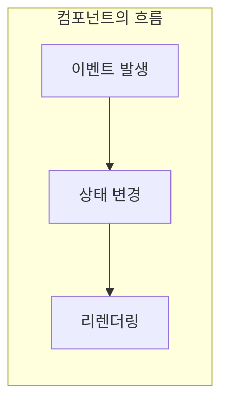

## 💁 설명

바닐라JS를 이용하여 선언형 컴포넌트를 만듭니다.

<!--end-of-description-->

## 공통 준비사항

### index.html

```html
<!DOCTYPE html>
<html lang="en">
  <head>
    <meta charset="UTF-8" />
    <meta http-equiv="X-UA-Compatible" content="IE=edge" />
    <meta name="viewport" content="width=device-width, initial-scale=1.0" />
    <title>선언형 컴포넌트</title>
  </head>
  <body>
    <div id="app"></div>
    <script src="main.js"></script>
  </body>
</html>
```

위와 같이 html 파일이 주어졌을 때 각 미션마다 주어진 요구사항을 만족하는 `main.js` 파일을 만듭니다.

## 토글 버튼 만들기

### 요구사항

```plain
- [ ] 화면에 버튼을 3개 만들고, 버튼을 클릭하면 취소선이 그어지도록 하세요.
```

### 단계별 추상화

#### 명령형 프로그래밍 방식

```js
const $button1 = document.createElement("button");
$button1.textContent = "버튼1";

const $button2 = document.createElement("button");
$button2.textContent = "버튼2";

const $button3 = document.createElement("button");
$button3.textContent = "버튼3";

const $app = document.querySelector("#app");
$app.appendChild($button1);
$app.appendChild($button2);
$app.appendChild($button3);

document.querySelectorAll("button").forEach(($button) => {
  $button.addEventListener("click", (e) => {
    const { target } = e;

    if (target.style.textDecoration === "line-through") {
      target.style.textDecoration = "none";
    } else {
      target.style.textDecoration = "line-through";
    }
  });
});
```

위 코드에서 if문으로 시작하는 `target.style.textDecoration` 코드 청크(chunk)는 `target` 데이터를 처리하는 규칙을 코드로 적은 것입니다. 요약하면, "취소선이 그어져 있으면 취소선을 없애고, 취소선이 없으면 취소선을 긋는 토글 기능"입니다. 데이터를 처리하는 하나의 규칙을 하나의 함수로 분리하면, 여러 줄의 코드가 하나의 이름으로 추상화되어 코드의 가독성이 올라갑니다.

<details>
<summary><strong>정리: 동일한 데이터를 처리하는 여러 줄의 코드 가독성 올리기</strong></summary>

<ul>
  <li>동일한 데이터를 처리하는 규칙을 담고 있는 여러 줄의 코드를 하나의 함수로 분리합니다.</li>
  <li>규칙을 몇 단어로 요약하여 함수의 이름으로 붙입니다.</li>
</ul>

그러면 여러 줄의 코드가 하나의 이름(함수 이름)으로 추상화되어 코드의 가독성이 올라갑니다.

</details>

#### 토글 기능을 함수로 추상화

```js
const $button1 = document.createElement("button");
$button1.textContent = "버튼1";

const $button2 = document.createElement("button");
$button2.textContent = "버튼2";

const $button3 = document.createElement("button");
$button3.textContent = "버튼3";

const $app = document.querySelector("#app");
$app.appendChild($button1);
$app.appendChild($button2);
$app.appendChild($button3);

const toggleLineThrough = (button) => {
  if (button.style.textDecoration === "line-through") {
    button.style.textDecoration = "none";
  } else {
    button.style.textDecoration = "line-through";
  }
};

document.querySelectorAll("button").forEach(($button) => {
  $button.addEventListener("click", (e) => {
    const { target } = e;

    toggleLineThrough(target);
  });
});
```

이제 선언형 프로그래밍 방식으로 바꿔보겠습니다. 선언형 프로그래밍의 특징은 무언가를 구현한다고 할 때, 그것을 구현하는 순서나 방법 같은 "어떻게"를 작성하는 게 아니라 구현하고자 하는 바가 "무엇"인지 작성하는 것입니다.

HTML 요소를 예로 들어보겠습니다. Github 주소인 `www.github.com`으로 이동하는 링크를 구현한다고 하면 아래와 같이 작성하면 됩니다.

```html
<a href="www.github.com">Github으로 이동</a>
```

요소 a가 "어떻게" 동작하는지 우리는 전혀 모릅니다. `href` 속성에 URL을 넣으면 그게 안에서 어떻게 처리되는지도 모릅니다. 클릭 이벤트를 어떻게 처리하는지도 보이지 않습니다. 다만 링크 요소를 구현할 때 필요한 핵심 정보인 `a`, `href="www.github.com"`, `Github으로 이동`을 명시적으로 전달할 뿐입니다. 동작에 대한 세부적인 구현은 숨겨져 있습니다.

<details>
<summary><strong>정리: 선언형으로 컴포넌트를 작성하는 방법</strong></summary>

컴포넌트의 핵심 데이터는 밖에서 전달하고 세부 구현은 안으로 숨깁니다.

</details>

토글 버튼을 사용하는 입장에서 핵심 정보는 무엇일까요? "(1) 토글 버튼을 어디에 추가할 것인지"와 "(2) 버튼 텍스트"만 밖에서 전달하도록 하고 나머지는 컴포넌트 내부에 뭉쳐보겠습니다.

#### 선언형 프로그래밍 방식

```js
function ToggleButton({ $target, text }) {
  const $button = document.createElement("button");

  let isInit = false;

  this.toggle = () => {
    if ($button.style.textDecoration === "line-through") {
      $button.style.textDecoration = "none";
    } else {
      $button.style.textDecoration = "line-through";
    }
  };

  this.render = () => {
    $button.textContent = text;

    if (!isInit) {
      $target.appendChild($button);

      $button.addEventListener("click", () => {
        this.toggle();
      });

      isInit = true;
    }
  };

  this.render();
}

const $app = document.querySelector("#app");

new ToggleButton({
  $target: $app,
  text: "버튼1",
});

new ToggleButton({
  $target: $app,
  text: "버튼2",
});

new ToggleButton({
  $target: $app,
  text: "버튼3",
});
```

토글 버튼에 필요한 내용들이 `ToggleButton`에 모두 응집되었습니다. `new ToggleButton()`으로 토글 버튼을 생성하는 코드를 보면 토글 버튼을 만드는 방법이 매우 간단해졌다는 것을 알 수 있습니다. 핵심 데이터는 밖에서 전달하고 나머지 세부구현은 컴포넌트 내부로 숨긴 덕분에 코드를 재사용하는 것도 간편해졌고, 작성된 코드를 읽는 것도 매우 쉬워졌습니다. 이밖에 토글 버튼 코드를 유지보수하고 기능을 확장하는 관점에서 선언형 방식은 어떤 이점이 있을까요?

명령형 방식과 선언형 방식에 동일한 기능을 새롭게 추가한다고 가정해볼게요. 위 선언형 방식에서는 `ToggleButton` 컴포넌트 안에 새로운 기능을 추가하면 됩니다. 하지만 명령형 방식은 토글 버튼을 담당하는 코드의 범위나 영역이 불분명하고, 코드의 순서가 명령의 순서이기 때문에 명령의 순서를 잘 알아야 하고, 기능을 추가하다가 자칫 명령의 순서가 잘못 꼬일 위험이 있습니다. 코드의 길이가 조금만 길어져도 명령형 코드는 쉽게 한 눈에 잘 들어오지 않기 때문입니다. 반면에 선언형 토글 버튼은 렌더링되는 시점 등 찾고자 하는 코드의 의도가 어디에 있는지 한 눈에 알 수 있습니다.

좀 더 구체적으로 버튼의 토글 횟수를 세는 기능을 추가한다고 가정해보겠습니다.

#### 명령형 방식

```js
const $button1 = document.createElement("button");
$button1.textContent = "버튼1";
$button1.className = "button1"; // 어떤 버튼인지 알기 위해 클래스를 추가한다
let button1ToggleCount = 0; // 버튼1에 대한 토글 카운트 변수를 추가한다

const $button2 = document.createElement("button");
$button2.textContent = "버튼2";
$button2.className = "button2";
let button2ToggleCount = 0;

const $button3 = document.createElement("button");
$button3.textContent = "버튼3";
$button3.className = "button3";
let button3ToggleCount = 0;

const $app = document.querySelector("#app");
$app.appendChild($button1);
$app.appendChild($button2);
$app.appendChild($button3);

const toggleLineThrough = (button) => {
  if (button.style.textDecoration === "line-through") {
    button.style.textDecoration = "none";

    if (button.className === "button1") {
      // 버튼1이라면
      button1ToggleCount++;
      button.textContent = `버튼1 (${button1ToggleCount})`;
    }

    if (button.className === "button2") {
      // 버튼2이라면
      button2ToggleCount++;
      button.textContent = `버튼2 (${button2ToggleCount})`;
    }

    if (button.className === "button3") {
      // 버튼3이라면
      button3ToggleCount++;
      button.textContent = `버튼3 (${button3ToggleCount})`;
    }
  } else {
    button.style.textDecoration = "line-through";
  }
};

document.querySelectorAll("button").forEach(($button) => {
  $button.addEventListener("click", (e) => {
    const { target } = e;

    toggleLineThrough(target);
  });
});
```

위와 같이 명령형으로 작성해도 정상적으로 동작하지만, 버튼의 개수가 더 많아진다거나 또 다른 새로운 기능을 추가해야 하는 상황이 오면 버그가 만들어질 확률이 큽니다. 코드가 길어지고 복잡해질수록 원하는 코드의 로직을 찾기가 더 어려워지기 때문입니다. 선언형 방식으로 동일한 기능 추가를 구현해보겠습니다.

<details>
<summary><strong>정리: 명령형으로 작성한 토글 버튼 코드가 기능을 추가할수록 복잡해지는 이유</strong></summary>

취소선을 긋는 토글 기능은 함수로 분리되어 재사용이 가능해졌지만, 만들어진 토글 버튼을 식별하는 이름(ex. button1, button2, button3)은 재사용이 불가능하고 일일이 관리해야 하기 때문입니다. 결과적으로 명령형으로 작성된 토글 버튼 코드는, 토글 버튼에 대한 식별자가 필요한 기능을 하나씩 추가 구현할 때마다 로직 내부의 코드도 복잡도가 증가할 수밖에 없습니다.

</details>

#### 선언형 방식

```js
function ToggleButton({ $target, text }) {
  const $button = document.createElement("button");

  let isInit = false;
  let toggleCount = 0;

  this.toggle = () => {
    if ($button.style.textDecoration === "line-through") {
      $button.style.textDecoration = "none";

      toggleCount++;
      $button.textContent = `${text} (${toggleCount})`;
    } else {
      $button.style.textDecoration = "line-through";
    }
  };

  this.render = () => {
    $button.textContent = text;

    if (!isInit) {
      $target.appendChild($button);

      isInit = true;
    }
  };

  $button.addEventListener("click", () => {
    this.toggle();
  });

  this.render();
}

const $app = document.querySelector("#app");

new ToggleButton({
  $target: $app,
  text: "버튼1",
});

new ToggleButton({
  $target: $app,
  text: "버튼2",
});

new ToggleButton({
  $target: $app,
  text: "버튼3",
});
```

반면에 선언적으로 작성한 토글 버튼 컴포넌트는 버튼에 대한 식별자가 컴포넌트 내부에 있어서 식별자가 필요한 기능을 새롭게 추가하더라도 간단하게 처리할 수 있습니다.

## 기능 추가하기 1

### 요구사항

```plain
- [ ] 3번 클릭하면 alert 창을 띄우세요.
```

### 구현

```js
function ToggleButton({ $target, text }) {
  const $button = document.createElement("button");

  let isInit = false;
  let clickCount = 0;

  this.toggle = () => {
    if ($button.style.textDecoration === "line-through") {
      $button.style.textDecoration = "none";
    } else {
      $button.style.textDecoration = "line-through";
    }
  };

  this.render = () => {
    if (!isInit) {
      $button.textContent = text;

      $target.appendChild($button);

      isInit = true;
    }
  };

  $button.addEventListener("click", () => {
    clickCount++;

    this.toggle();

    if (clickCount % 3 === 0) {
      alert("3번째 클릭!");
    }
  });

  this.render();
}

const $app = document.querySelector("#app");

new ToggleButton({
  $target: $app,
  text: "버튼1",
});

new ToggleButton({
  $target: $app,
  text: "버튼2",
});

new ToggleButton({
  $target: $app,
  text: "버튼3",
});
```

나머지 연산 로직을 컴포넌트 내부에 추가하여 간단하게 기능을 추가할 수 있습니다.

## 기능 추가하기 2

### 요구사항

```plain
- [ ] 첫번째 버튼은 2번 클릭하면 alert 창을 띄우고 두번째 버튼은 3번 클릭하면 alert 버튼을 띄우세요.
```

### 동일한 컴포넌트에 서로 다른 동작 구현하기

토글 버튼의 취소선 토글 기능은 동일하지만 그 외에 서로 다른 동작을 하게 만들려면 어떻게 해야 할까요? 가장 간단한 방법 중 하나는 외부에서 행동을 주입하는 것입니다.

```js
function ToggleButton({ $target, text, onClick }) {
  const $button = document.createElement("button");

  let isInit = false;
  let clickCount = 0;

  this.toggle = () => {
    if ($button.style.textDecoration === "line-through") {
      $button.style.textDecoration = "none";
    } else {
      $button.style.textDecoration = "line-through";
    }
  };

  this.render = () => {
    if (!isInit) {
      $button.textContent = text;

      $target.appendChild($button);

      isInit = true;
    }
  };

  $button.addEventListener("click", () => {
    clickCount++;

    this.toggle();

    onClick && onClick(clickCount);
  });

  this.render();
}

const $app = document.querySelector("#app");

new ToggleButton({
  $target: $app,
  text: "버튼1",
  onClick: (clickCount) => {
    if (clickCount % 2 === 0) {
      alert("2번째 클릭!");
    }
  },
});

new ToggleButton({
  $target: $app,
  text: "버튼2",
  onClick: (clickCount) => {
    if (clickCount % 3 === 0) {
      alert("3번째 클릭!");
    }
  },
});

new ToggleButton({
  $target: $app,
  text: "버튼3",
});
```

<details>
<summary><strong>정리: 재사용이 가능한 컴포넌트에 별개의 행동을 추가하는 방법</strong></summary>

컴포넌트 외부에서 컴포넌트 내부로 행동을 주입하면 됩니다. 이렇게 되면 코드를 읽는 관점에서도 이득이 생깁니다. 왜냐하면 컴포넌트를 사용할 때 하고자 하는 행동을 코드로 드러내게 되어, 해당 컴포넌트가 어떤 별개의 행동을 할 지 한 눈에 알 수 있기 때문입니다. 여전히 "핵심 정보는 밖에서 전달하고, 세부 구현은 안으로 숨긴다"는 규칙을 지켜서 코드의 로직을 쉽게 파악할 수 있게 됩니다.

</details>

## 기능 추가하기 3

### 요구사항

```plain
- [ ] 기존 토글 버튼에서 버튼을 클릭하기 전에 볼드(bold) 처리하고 클릭하면 bold 처리를 취소하도록 만드세요.
```

### 기존 코드에서 기능을 추가할 경우

기존 코드를 유지하면서 볼드 표시를 토글하는 기능을 추가하려면 아래와 같이, 초기 스타일에 볼드 처리를 하고 toggle 함수 안에도 if문을 추가하여 볼드 처리 로직을 추가해야 합니다.

```js
function ToggleButton({ $target, text, onClick }) {
  const $button = document.createElement("button");
  $button.style.fontWeight = "700"; // added

  let isInit = false;
  let clickCount = 0;

  this.toggle = () => {
    if ($button.style.textDecoration === "line-through") {
      $button.style.textDecoration = "none";
    } else {
      $button.style.textDecoration = "line-through";
    }

    // added
    if ($button.style.fontWeight === "700") {
      $button.style.fontWeight = ""; // 참고로 빈 문자열을 넣으면 해당 스타일의 기본값이 반영됩니다.
    } else {
      $button.style.fontWeight = "700";
    }
  };

  this.render = () => {
    if (!isInit) {
      $button.textContent = text;

      $target.appendChild($button);

      isInit = true;
    }
  };

  $button.addEventListener("click", () => {
    clickCount++;

    this.toggle();

    onClick && onClick(clickCount);
  });

  this.render();
}
```

그런데 토글 상태에 따라 UI를 업데이트하게 만들면 더 편하지 않을까요?

가령 다음과 같이 말입니다:

```js
$button.style.textDecoration = toggled ? "line-through" : "none";
$button.style.fontWeight = toggled ? "" : "700";
```

잘 생각해보면 토글 버튼 컴포넌트가 렌더링하는 흐름을 다음과 같이 정리할 수 있습니다:

1. 사용자가 클릭하면 토글 상태가 변경된다. 즉, `이벤트 발생 => 컴포넌트의 상태 변경`
2. 토글 상태가 변경되면 규칙에 따라 스타일이 변경되어야 한다. 즉, `상태 변경 => UI 변경`

우리가 해야 할 일은 크게 다음과 같습니다:

1. 이벤트 발생에 따라 상태 변경하기
2. 변경된 상태에 따라 UI 렌더링하기

### 상태에 따라 렌더링하도록 만들기

```js
function ToggleButton({ $target, text, onClick }) {
  const $button = document.createElement("button");

  let isInit = false;

  // 상태 초기화
  this.state = {
    clickCount: 0,
    toggled: false,
  };

  // 03 상태가 변경되면 리렌더링한다
  this.setState = (nextState) => {
    this.state = nextState; // 상태 변경
    this.render(); // 리렌더
  };

  // 04 렌더 함수는 현재 상태를 기준으로 렌더링을 한다
  this.render = () => {
    $button.textContent = `${text} (${this.state.clickCount})`;

    $button.style.textDecoration = this.state.toggled ? "line-through" : "none";
    $button.style.fontWeight = this.state.toggled ? "" : "700";

    if (!isInit) {
      $target.appendChild($button);

      isInit = true;
    }
  };

  // 01 이벤트가 발생하면
  $button.addEventListener("click", () => {
    // 02 상태를 변경하고
    this.setState({
      clickCount: this.state.clickCount + 1,
      toggled: !this.state.toggled,
    });

    // 개별 행동도 마찬가지로 현재 상태를 기준으로 행동을 한다
    onClick && onClick(this.state.clickCount);
  });

  this.render();
}
```

달라진 점:

- 이벤트가 발생하면 UI를 바로 변경하는게 아니라 상태를 변경하게 되었습니다.
- 상태가 변경되면 자동으로 리렌더링하게 되었습니다.
- UI를 변경하는 토글 함수 코드가 렌더 함수 내부로 이동했습니다.

즉, 컴포넌트가 "상태가 변경되면 자동으로 리렌더링"하는 일련의 흐름을 가지게 되었습니다. 코드가 일련의 흐름을 가지면 코드의 유지보수와 확장이 쉬워집니다. 원하는 로직이 어디에 있는지 더 쉽게 알 수 있기 때문입니다. 가령, 이전처럼 DOM을 여기저기서 수정할 필요가 없어졌습니다. DOM 수정은 UI와 관련된 코드이므로 렌더 함수 안에서 찾고 변경하면 됩니다.



이제 새로운 기능을 추가하고 싶다면 우리가 할 일은 다음으로 구분됩니다:

- 이벤트 발생에 따라 상태를 어떻게 변경하면 될지 코드를 작성합니다.
- 상태에 따라 UI를 어떻게 변경하면 될지 코드를 작성합니다.

## 기능 추가하기 4

### 요구사항

```plain
- [ ] 5초 뒤에 자동으로 토글되는 버튼을 만드세요.
```

### 구현

기존 토글 버튼을 확장해서 구현할 수 있습니다.

```js
function TimerButton({ $target, text, timer = 3000 }) {
  const button = new ToggleButton({
    $target,
    text,
    onClick: () => {
      setTimeout(() => {
        button.setState({
          ...button.state,
          toggled: !button.state.toggled,
        });
      }, timer);
    },
  });
}

function ToggleButton({ $target, text, onClick }) {
  const $button = document.createElement("button");

  let isInit = false;

  this.state = {
    clickCount: 0,
    toggled: false,
  };

  this.setState = (nextState) => {
    this.state = nextState;
    this.render();
  };

  this.render = () => {
    $button.textContent = `${text} (${this.state.clickCount})`;

    $button.style.textDecoration = this.state.toggled ? "line-through" : "none";

    if (!isInit) {
      $target.appendChild($button);

      isInit = true;
    }
  };

  $button.addEventListener("click", () => {
    this.setState({
      clickCount: this.state.clickCount + 1,
      toggled: !this.state.toggled,
    });

    onClick && onClick(this.state.clickCount);
  });

  this.render();
}

const $app = document.querySelector("#app");

new ToggleButton({
  $target: $app,
  text: "버튼1",
  onClick: (clickCount) => {
    if (clickCount % 2 === 0) {
      alert("2번째 클릭!");
    }
  },
});

new ToggleButton({
  $target: $app,
  text: "버튼2",
  onClick: (clickCount) => {
    if (clickCount % 3 === 0) {
      alert("3번째 클릭!");
    }
  },
});

new ToggleButton({
  $target: $app,
  text: "버튼3",
});

new TimerButton({
  $target: $app,
  text: "3초 타이머",
});

new TimerButton({
  $target: $app,
  text: "10초 타이머",
  timer: 10 * 1000,
});
```

## 기능 추가하기 5

### 요구사항

```plain
- [ ] 인자로 type과 timer 값을 입력하면 자동으로 토글 버튼이나 타이머 버튼을 추가하는 ButtonGroup 컴포넌트를 만드세요.
```

### 구현

```js
function ButtonGroup({ $target, buttons }) {
  const $group = document.createElement("div");
  let isInit = false;

  this.render = () => {
    if (!isInit) {
      buttons.forEach(({ type, ...props }) => {
        if (type === "toggle") {
          new ToggleButton({ $target: $group, ...props });
        } else if (type === "timer") {
          new TimerButton({ $target: $group, ...props });
        }
      });

      $target.appendChild($group);
      isInit = true;
    }
  };

  this.render();
}

function TimerButton({ $target, text, timer = 3000 }) {
  const button = new ToggleButton({
    $target,
    text,
    onClick: () => {
      setTimeout(() => {
        button.setState({
          ...button.state,
          toggled: !button.state.toggled,
        });
      }, timer);
    },
  });
}

function ToggleButton({ $target, text, onClick }) {
  const $button = document.createElement("button");

  let isInit = false;

  this.state = {
    clickCount: 0,
    toggled: false,
  };

  this.setState = (nextState) => {
    this.state = nextState;
    this.render();
  };

  this.render = () => {
    $button.textContent = `${text} (${this.state.clickCount})`;

    $button.style.textDecoration = this.state.toggled ? "line-through" : "none";

    if (!isInit) {
      $target.appendChild($button);

      isInit = true;
    }
  };

  $button.addEventListener("click", () => {
    this.setState({
      clickCount: this.state.clickCount + 1,
      toggled: !this.state.toggled,
    });

    onClick && onClick(this.state.clickCount);
  });

  this.render();
}

const $app = document.querySelector("#app");

new ButtonGroup({
  $target: $app,
  buttons: [
    {
      type: "toggle",
      text: "토글 버튼",
    },
    {
      type: "timer",
      text: "타이머 버튼",
      timer: 1000,
    },
  ],
});
```

## 📚 함께 보기
