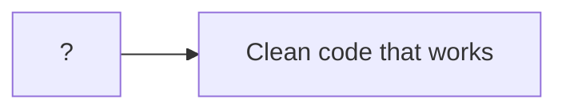
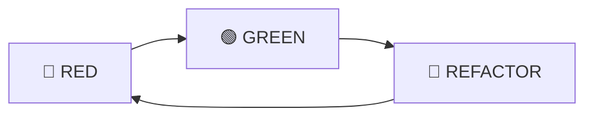

## 💁 프롤로그

> 시리즈 "[화폐 예제 실습으로 TDD의 리듬 느껴보기](/tags/tdd-by-example/)"에서 사용되는 공통 프롤로그입니다.



어떻게 하면 작동하는 깔끔한 코드(clean code that works)를 얻을 수 있을까요? 켄트 벡(Kent Beck)은 자동화된 테스트로 개발을 이끌어 가는 테스트 주도 개발(TDD, Test Driven Development)을 제안합니다. 과연 TDD를 하면 작동하는 깔끔한 코드를 얻을 수 있는지, 어떤 이유로 그러한지 궁금하네요. 책 [테스트 주도 개발(Test Driven Development: By Example)](http://www.yes24.com/Product/Goods/12246033)을 읽고 실습한 내용을 정리합니다.

<!--end-of-description-->

- [실습 코드](https://github.com/datalater/tdd-example-currency/)
- [회고]()

<details markdown="1">
<summary><strong>TDD 시작하기</strong></summary>

TDD는 두 가지 규칙을 따릅니다:

1. 오직 자동화된 테스트가 실패할 경우에만 새로운 코드를 작성한다.
2. 중복을 제거한다.

위 규칙에 의해 TDD로 코드를 짜는 순서는 다음과 같이 결정됩니다.

1. 레드(RED) - 실패하는 작은 테스트를 작성한다. 처음에는 컴파일조차 되지 않을 수 있다.
2. 그린(GREEN) - 빨리 테스트가 통과하게끔 만든다. 이를 위해 어떤 죄악을 저질러도 좋다.
3. 리팩토링(REFACTOR) - 일단 테스트를 통과하게만 하는 와중에 생겨난 모든 중복을 제거한다.

> 죄악이란 기존 코드 복사해서 붙이기(copy and paste), 테스트만 간신히 통과할 수 있게끔 함수가 무조건 특정 상수를 반환하도록 구현하기 등을 의미한다.



> 리팩토링(Refactoring)이란 코드의 외적 행위는 그대로 유지하면서 내부 구조를 변경하는 작업을 뜻한다.

</details>

<details markdown="1">
<summary><strong>화폐 예제의 목표</strong></summary>

화폐 예제를 실습하면서 가져야 할 목표는 TDD의 리듬을 느껴보는 것입니다.

> 내 목표는 여러분이 테스트 주도 개발(TDD)의 리듬을 보도록 하는 것이다. 그 리듬은 다음과 같이 요약할 수 있다.
>
> 1. 재빨리 테스트를 하나 추가한다.
> 2. 모든 테스트를 실행하고 새로 추가한 것이 실패하는지 확인한다.
> 3. 코드를 조금 바꾼다.
> 4. 모든 테스트를 실행하고 전부 성공하는지 확인한다.
> 5. 리팩토링을 통해 중복을 제거한다.
>
> 아마 당신은 다음과 같은 것에 대해 놀랄 것이다.
>
> - 각각의 테스트가 기능의 작은 증가분을 어떻게 커버하는지
> - 새 테스트를 돌아가게 하기 위해 얼마나 작고 못생긴 변화가 가능한지
> - 얼마나 자주 테스트를 실행하는지
> - 얼마나 수없이 작은 단계를 통해 리팩토링이 되어가는지 [^1]

> 이 예제를 통해 여러분은 코딩하기 전에 먼저 테스트를 만드는 법과 설계를 유기적으로 키워나가는(grow) 방법을 배우게 될 것이다. [^2]

</details>

<details markdown="1">
<summary><strong>화폐 예제 요구사항</strong></summary>

`AS-IS`에서 `TO-BE`로 변경하는 것이 화폐 예제의 요구사항입니다.

- `AS-IS`
  - 다음과 같은 보고서가 있다.

| 종목 |   주 | 가격 |  합계 |
| :--: | ---: | ---: | ----: |
| IBM  | 1000 |   25 |  2500 |
|  GE  |  400 |  100 | 40000 |
|      |      | 합계 | 65000 |

- `TO-BE`
  - 다중 통화를 지원하는 보고서를 만들어야 한다.
  - 환율을 명시해야 한다.

| 종목 |   주 |   가격 |     합계 |
| :--: | ---: | -----: | -------: |
| IBM  | 1000 |  25USD |  2500USD |
|  GE  |  400 | 100CHF | 40000CHF |
|      |      |   합계 | 65000USD |

| 기준 | 변환 | 환율 |
| :--: | ---: | ---: |
| CHF  |  USD |  1.5 |

</details>

<details markdown="1">
<summary><strong>할일 목록 읽는 법</strong></summary>

<!-- prettier-ignore-start -->
```diff
  $5 + 10CHF = $10(환율이 2:1일 경우)
+ $5 * 2 = $10
  amount를 private으로 만들기
- Dollar 부작용(side effect)?
  Money 반올림?
```
{: file="할일목록" }
<!-- prettier-ignore-end -->

- 일반: 작업해야 할 항목
- 빨강: 현재 작업을 시작한 항목
- 초록: 작업을 끝낸 항목

</details>

---

## 🎬 3장 타락한 객체 [^3]

### 지난 할일 목록

<!-- prettier-ignore-start -->
```diff
  $5 + 10CHF = $10(환율이 2:1일 경우)
+ $5 * 2 = $10
  amount를 private으로 만들기
+ Dollar 부작용(side effect)?
  Money 반올림?
```
{: file="할일목록" }
<!-- prettier-ignore-end -->

### 값 객체가 암시하는 것

> 값 객체가 암시하는 것 중 하나는 2장에서와 같이 모든 연산은 새 객체를 반환해야 한다는 것이다. 또다른 암시는 값 객체는 equals()를 구현해야 한다는 것인데, 왜냐하면 $5라는 것은 항상 다른 $5만큼이나 똑같이 좋은 것이기 때문이다.
>
> 만약 Dollar를 해시 테이블의 키로 쓸 생각이라면 equals()를 구현할 때 hashCode()를 같이 구현해야 한다. 이것을 할일 목록에 적어 놓고 이것 때문에 문제가 생기면 그때 다루도록 하자.

<!-- prettier-ignore-start -->
```diff
  $5 + 10CHF = $10(환율이 2:1일 경우)
+ $5 * 2 = $10
  amount를 private으로 만들기
+ Dollar 부작용(side effect)?
  Money 반올림?
- equals()
  hashCode()
```
{: file="할일목록" }
<!-- prettier-ignore-end -->

값 객체가 동일한 값인지 알기 위해서 `equals()`라는 함수를 작성할 것입니다. 이때 값 객체의 내부 메서드로 `equals()`를 구현합니다. 왜 이렇게 할까요? 우리가 만들려고 하는 `Dollar` 객체는 화폐 도메인에서 특정 조건을 만족하는 타입을 가진 값이므로 이럴 때 사용하는 값 객체 패턴을 활용하기 위해서입니다. 값 객체에 대한 설명은 아래 내용을 참고합니다.

<details markdown="1">
<summary><strong>값 객체란 무엇인가</strong></summary>

> [참조 - VO(Value Object)란?](https://velog.io/@livenow/Java-VOValue-Object%EB%9E%80)

(질문) 값 객체를 언제, 왜 사용할까?

(답변) 어떤 도메인의 (변하지 않는) "값"을 사용하려고 하는데 primitive 타입이 적절하지 않을 때 사용한다.

> 예를 들어, 나이를 나타낼 때 다음 중 어떤 변수 타입을 사용해야 할까?
>
> 1. Integer
> 2. Boolean
> 3. String
>
> 셋 다 아니다. 애초에 나이는 Integer가 아닐 뿐더러, 생각해보면 Integer는 나이가 가지지 않는 속성과 연산을 가지고 있다.
>
> - 두 나이를 더하거나 빼는 것이 말이 되는가? 아마도.
> - 두 나이를 곱하거나 나누는 것이 말이 되는가? 말이 안 된다.
> - 음수 나이를 허용하는 게 말이 되는가? 말이 안된다.
>
> 이렇게 값을 나타내는 도메인 객체를 사용하려고 하는데 primitive 타입으로 충족이 되지 않을 때 값 객체 패턴(Value Object Pattern)을 사용하면 쉽게 해결할 수 있다.

(특성) primitive 타입이 아니면서 값을 나타내려면 그 객체는 여러 가지 특성이 필요하다.

> 1. 유효한 값인지 알아야 한다. 즉, 변수에 할당하기 전에 적절한 값이 될 수 있는지에 대한 유효성 검사 로직이 필요하다.
> 2. (변하지 않는 값을 사용하려는 것이 전제이므로) 나중에 변경되지 않는 값이라는 것을 보장해야 한다.

> 이러한 특성을 가진 객체를 값 객체(Value Object)라고 한다.

(정리) 값 객체는 특정 도메인에 적절한 타입을 가진 값을 나타내는 객체이다. 그리고 값 객체의 특징은 불변성(immutability), 값 동치성(equality), 자가 유효성 검사(self validation)이 있다.

> - 불변성: 수정 메서드 setter가 없다.
> - 값 동치성: 내부 값이 같은지 확인할 수 있다.
> - 자가 유효성 검사: 생성자에서 유효한 값인지 검사한다.

</details>

따라서, 값 객체 내부에 값 동치성을 확인할 수 있는 `equals()` 메서드를 테스트 코드로 나타냅니다.

```ts
test("equals", () => {
  expect(new Dollar(5).equals(new Dollar(5))).toBe(true);
});
```

테스트 코드를 가장 빠르게 통과시키기 위해 가짜로 구현하는 방법은 단순히 true를 반환하는 것입니다.

```ts
class Dollar {
  amount: number;

  constructor(amount) {
    this.amount = amount;
  }

  times(multiplier: number) {
    return new Dollar(this.amount * multiplier);
  }

  equals(other: Dollar): boolean {
    return true;
  }
}
```

true는 어떻게 나오는 값일까요?

> 우리 둘 다 사실은 true가 '5 === 5'라는 것을 알고, 이것은 다시 'amount === 5'이며, 결국은 'amount === dollar.amount'임을 안다. 만약 이런 단계를 밟아간다면, 나는 가장 신중한 세 번째 방법인 삼각측량 전략을 보여주지 못하게 될 것 같다.

### 삼각측량을 사용하여 코드를 일반화하여 테스트 코드를 통과시키는 방법

> 만약 라디오 신호를 두 수신국이 감지하고 있을 때, 수신국 사이의 거리가 알려져 잇고 각 수신국이 신호의 방향을 알고 있다면, 이 정보들만으로 충분히 신호의 거리와 방위를 알 수 있다. 이 계산 법을 삼각측량이라고 한다.
>
> 삼각측량을 이용하려면 예제가 두 개 이상 있어야만 코드를 일반화할 수 있다. 테스트 코드와 모델 코드 사이의 중복(`true`)을 잠깐만 무시하자. 두 번째 예가 좀더 일반적인 해를 필요로 할 때, 오로지 그때만 비로소 일반화한다.

삼각측량을 사용하기 위해서 일반적인 해를 필요로 하는 두 번째 테스트 케이스(`$5 !== $6`)를 추가합니다.

```ts
test("equals", () => {
  expect(new Dollar(5).equals(new Dollar(5))).toBe(true);
  expect(new Dollar(5).equals(new Dollar(6))).toBe(false);
});
```

테스트를 통과시키기 위해 동치성이 일반적인 상황에서도 모두 동작하는 코드를 구현합니다.

```ts
class Dollar {
  amount: number;

  constructor(amount) {
    this.amount = amount;
  }

  times(multiplier: number) {
    return new Dollar(this.amount * multiplier);
  }

  equals(other: Dollar): boolean {
    return this.amount === other.amount;
  }
}
```

<!-- prettier-ignore-start -->
```diff
  $5 + 10CHF = $10(환율이 2:1일 경우)
+ $5 * 2 = $10
  amount를 private으로 만들기
+ Dollar 부작용(side effect)?
  Money 반올림?
+ equals()
  hashCode()
```
{: file="할일목록" }
<!-- prettier-ignore-end -->

항상 삼각측량을 사용할 필요는 없습니다. 해법이 보이면 그 방법대로 구현하면 됩니다.

> 나는 어떻게 리팩토링해야 하는지 전혀 감이 안 올때만 삼각측량을 사용한다. 코드와 테스트 사이의 중복을 제거하고 일반적인 해법을 구할 방법이 보이면 그냥 그 방법대로 구현한다.

하지만 설계를 어떻게 해야 할지 감이 잡히지 않을 때 다른 방향으로 생각해볼 기회를 준다는 점에서는 유용합니다.

> 그러나 설계를 어떻게 할지 떠오르지 않을 때면, 삼각측량은 문제를 조금 다른 방향에서 생각해볼 기회를 제공한다. 지금 설계하는 프로그램이 어떤 변화 가능성을 지원해야 하는가? 몇몇 부분을 변경시켜보면 답이 좀 명확해질 것이다.

### 널 값이나 다른 객체들과 값 비교하기

동일성 문제는 해결됐지만 널 값이나 다른 객체들과 비교하면 어떻게 될까요?

> 이런 상황은 일반적이긴 하지만, 지금 당장은 필요하지 않다. 따라서 할일 목록에 적어두기만 하자.

지금 당장 필요하지 않으므로 할일 목록에만 적어둡니다.

<!-- prettier-ignore-start -->
```diff
  $5 + 10CHF = $10(환율이 2:1일 경우)
+ $5 * 2 = $10
  amount를 private으로 만들기
+ Dollar 부작용(side effect)?
  Money 반올림?
+ equals()
  hashCode()
  Equal null
  Equal object
```
{: file="할일목록" }
<!-- prettier-ignore-end -->

### 정리

> 이제 동질성 기능을 구현했으므로 Dollar와 Dollar를 직접 비교할 수 있게 됐다. 따라서 모든 올바른 인스턴스 변수들이 그렇듯 amount를 private으로 만들 수 있게 됐다.
>
> 위 내용들을 검토해보자. 우리는
>
> - **우리의 디자인 패턴(값 객체)이 하나의 또 다른 오퍼레이션(값 동치성)을 암시한다는 것을 알아챘다.**
> - 해당 오퍼레이션을 테스트했다.
> - 해당 오퍼레이션을 간단히 구현했다.
> - 곧장 리팩토링하는 대신 테스트를 조금 더 했다. (삼각측량을 위해)
> - 두 경우를 모두 수용할 수 있도록 리팩토링 했다.

## 📚 함께 읽기

- [테스트 주도 개발](http://www.yes24.com/Product/Goods/12246033)
- [실습 코드](https://github.com/datalater/tdd-example-currency/)
- [회고]()

## 🔖 주석

[^1]: 테스트 주도 개발. 1부. 38쪽.
[^2]: 테스트 주도 개발. 들어가는 글. 27쪽.
[^3]: 테스트 주도 개발. 3장. 59쪽.
