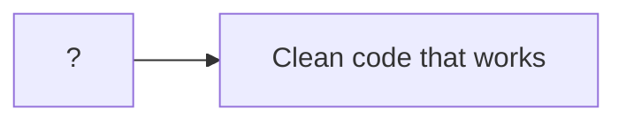
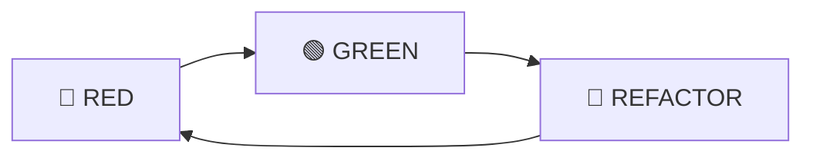

## 💁 프롤로그

> 시리즈 "[화폐 예제 실습으로 TDD의 리듬 느껴보기](/tags/tdd-by-example/)"에서 사용되는 공통 프롤로그입니다.



어떻게 하면 작동하는 깔끔한 코드(clean code that works)를 얻을 수 있을까요? 켄트 벡(Kent Beck)은 자동화된 테스트로 개발을 이끌어 가는 테스트 주도 개발(TDD, Test Driven Development)을 제안합니다. 과연 TDD를 하면 작동하는 깔끔한 코드를 얻을 수 있는지, 어떤 이유로 그러한지 궁금하네요. 책 [테스트 주도 개발(Test Driven Development: By Example)](http://www.yes24.com/Product/Goods/12246033)을 읽고 실습한 내용을 정리합니다.

<!--end-of-description-->

- [실습 코드](https://github.com/datalater/tdd-example-currency/)
- [회고]()

<details markdown="1">
<summary><strong>TDD 시작하기</strong></summary>

TDD는 두 가지 규칙을 따릅니다:

1. 오직 자동화된 테스트가 실패할 경우에만 새로운 코드를 작성한다.
2. 중복을 제거한다.

위 규칙에 의해 TDD로 코드를 짜는 순서는 다음과 같이 결정됩니다.

1. 레드(RED) - 실패하는 작은 테스트를 작성한다. 처음에는 컴파일조차 되지 않을 수 있다.
2. 그린(GREEN) - 빨리 테스트가 통과하게끔 만든다. 이를 위해 어떤 죄악을 저질러도 좋다.
3. 리팩토링(REFACTOR) - 일단 테스트를 통과하게만 하는 와중에 생겨난 모든 중복을 제거한다.

> 죄악이란 기존 코드 복사해서 붙이기(copy and paste), 테스트만 간신히 통과할 수 있게끔 함수가 무조건 특정 상수를 반환하도록 구현하기 등을 의미한다.



> 리팩토링(Refactoring)이란 코드의 외적 행위는 그대로 유지하면서 내부 구조를 변경하는 작업을 뜻한다.

</details>

<details markdown="1">
<summary><strong>화폐 예제의 목표</strong></summary>

화폐 예제를 실습하면서 가져야 할 목표는 TDD의 리듬을 느껴보는 것입니다.

> 내 목표는 여러분이 테스트 주도 개발(TDD)의 리듬을 보도록 하는 것이다. 그 리듬은 다음과 같이 요약할 수 있다.
>
> 1. 재빨리 테스트를 하나 추가한다.
> 2. 모든 테스트를 실행하고 새로 추가한 것이 실패하는지 확인한다.
> 3. 코드를 조금 바꾼다.
> 4. 모든 테스트를 실행하고 전부 성공하는지 확인한다.
> 5. 리팩토링을 통해 중복을 제거한다.
>
> 아마 당신은 다음과 같은 것에 대해 놀랄 것이다.
>
> - 각각의 테스트가 기능의 작은 증가분을 어떻게 커버하는지
> - 새 테스트를 돌아가게 하기 위해 얼마나 작고 못생긴 변화가 가능한지
> - 얼마나 자주 테스트를 실행하는지
> - 얼마나 수없이 작은 단계를 통해 리팩토링이 되어가는지 [^1]

> 이 예제를 통해 여러분은 코딩하기 전에 먼저 테스트를 만드는 법과 설계를 유기적으로 키워나가는(grow) 방법을 배우게 될 것이다. [^2]

</details>

<details markdown="1">
<summary><strong>화폐 예제 요구사항</strong></summary>

`AS-IS`에서 `TO-BE`로 변경하는 것이 화폐 예제의 요구사항입니다.

- `AS-IS`
  - 다음과 같은 보고서가 있다.

| 종목 |   주 | 가격 |  합계 |
| :--: | ---: | ---: | ----: |
| IBM  | 1000 |   25 |  2500 |
|  GE  |  400 |  100 | 40000 |
|      |      | 합계 | 65000 |

- `TO-BE`
  - 다중 통화를 지원하는 보고서를 만들어야 한다.
  - 환율을 명시해야 한다.

| 종목 |   주 |   가격 |     합계 |
| :--: | ---: | -----: | -------: |
| IBM  | 1000 |  25USD |  2500USD |
|  GE  |  400 | 100CHF | 40000CHF |
|      |      |   합계 | 65000USD |

| 기준 | 변환 | 환율 |
| :--: | ---: | ---: |
| CHF  |  USD |  1.5 |

</details>

<details markdown="1">
<summary><strong>할일 목록 읽는 법</strong></summary>

<!-- prettier-ignore-start -->
```diff
  $5 + 10CHF = $10(환율이 2:1일 경우)
+ $5 * 2 = $10
  amount를 private으로 만들기
- Dollar 부작용(side effect)?
  Money 반올림?
```
{: file="할일목록" }
<!-- prettier-ignore-end -->

- 일반: 작업해야 할 항목
- 빨강: 현재 작업을 시작한 항목
- 초록: 작업을 끝낸 항목

</details>

---

## 🎬 4장 프라이버시 [^3]

### 지난 할일 목록

<!-- prettier-ignore-start -->
```diff
  $5 + 10CHF = $10(환율이 2:1일 경우)
+ $5 * 2 = $10
- amount를 private으로 만들기
+ Dollar 부작용(side effect)?
  Money 반올림?
+ equals()
  hashCode()
  Equal null
  Equal Object
```
{: file="할일목록" }
<!-- prettier-ignore-end -->

- `+`: 완료된 항목
- `-`: 지금 진행할 항목

### 지난 코드

```ts
class Dollar {
  amount: number;

  constructor(amount) {
    this.amount = amount;
  }

  times(multiplier: number) {
    return new Dollar(this.amount * multiplier);
  }

  equals(other: Dollar) {
    return this.amount === other.amount;
  }
}

test("곱하기", () => {
  const five: Dollar = new Dollar(5);
  let product: Dollar;
  product = five.times(2);
  expect(product.amount).toBe(10);
  product = five.times(3);
  expect(product.amount).toBe(15);
});

test("값 동치성", () => {
  expect(new Dollar(5).equals(new Dollar(5))).toBe(true);
  expect(new Dollar(5).equals(new Dollar(6))).toBe(false);
});
```

### 테스트가 정확히 말하고 있는가

(지침) 앞에서 `equals()`를 구현해서 동치성 문제를 정의했으므로 이를 이용하여 테스트가 조금 더 많은 이야기를 해줄 수 있도록 만드세요.

(목표) 개념적으로 `Dollar.times()` 연산은 호출을 받은 객체의 값에 인자로 받은 곱수만큼 곱한 값을 갖는 `Dollar`를 반환해야 합니다.

(문제) 현재 테스트는 그것을 정확히 말하지 않습니다.

```ts
product = five.times(2);
expect(product.amount).toBe(10);
```

(해결) 첫 번째 단언(assertion)을 `Dollar`와 `Dollar`를 비교하는 것으로 재작성합니다.

```ts
product = five.times(2);
expect(product).toBe(new Dollar(10));
```

(적용) 두 번째 단언도 마찬가지로 고칩니다.

```ts
product = five.times(2);
expect(product).toBe(new Dollar(10));
product = five.times(3);
expect(product).toBe(new Dollar(15));
```

임시 변수인 `product`가 쓸모없어 보이므로 인라인시킵니다.

```ts
test("곱하기", () => {
  const five: Dollar = new Dollar(5);
  expect(five.times(2)).toBe(new Dollar(10));
  expect(five.times(3)).toBe(new Dollar(15));
});
```

이 테스트는 일련의 오퍼레이션이 아니라 참인 명제에 대한 단언들이므로 우리의 의도를 더 명확하게 이야기해줍니다.

(리팩터) 테스트를 고치고 나니 이제 `Dollar`의 `amount` 인스턴스 변수를 사용하는 코드는 `Dollar` 자신밖에 없게 됐습니다. 따라서 변수를 `private`으로 변경할 수 있습니다.

```ts
class Dollar {
  private amount: number;

  constructor(amount) {
    this.amount = amount;
  }

  times(multiplier: number) {
    return new Dollar(this.amount * multiplier);
  }

  equals(other: Dollar) {
    return this.amount === other.amount;
  }
}
```

<!-- prettier-ignore-start -->
```diff
  $5 + 10CHF = $10(환율이 2:1일 경우)
+ $5 * 2 = $10
+ amount를 private으로 만들기
+ Dollar 부작용(side effect)?
  Money 반올림?
+ equals()
  hashCode()
  Equal null
  Equal Object
```
{: file="할일목록" }
<!-- prettier-ignore-end -->

### TDD를 하면서 적극적으로 관리해야 할 위험 요소

동치성 테스트가 통과되었습니다. 그러나 동치성 테스트가 동치성에 대한 코드가 정확히 작동한다는 것을 검증하는 데 실패한다면, 곱하기 테스트 역시 곱하기에 대한 코드가 정확하게 작동한다는 것을 검증하는 데 실패하게 됩니다. 이것은 TDD를 하면서 적극적으로 관리해야 할 위험 요소입니다.

### 우리는 완벽함을 위해 노력하지는 않는다

(주의) TDD를 하면서 우리는 완벽함을 위해 노력하지 않습니다. 모든 것을 두 번 말함으로써(코드와 테스트로 한 번씩) 자신감을 가지고 전진할 수 있을 만큼만 결함의 정도를 낮추기를 희망할 뿐입니다. (문제) 때떄로 우리의 추론이 맞지 않아서 결함이 손가락 사이로 빠져나가는 수가 있습니다. (대처) 그럴 때면 테스트를 어떻게 작성해야 했는지에 대한 교훈을 얻고 다시 앞으로 나아갑니다.

### 지금까지 배운 것

- 오직 테스트를 향상시키기 위해서만 개발된 기능을 사용했다.
- 두 테스트가 동시에 실패하면 망한다는 점을 인식했다.
- 위험 요소가 있음에도 계속 진행했다.
- 테스트와 코드 사이의 결합도를 낮추기 위해, 테스트하는 객체의 새 기능을 사용했다.

## 📚 함께 읽기

- [테스트 주도 개발](http://www.yes24.com/Product/Goods/12246033)
- [실습 코드 - 4장 프라이버시](https://github.com/datalater/tdd-by-example-currency/tree/4%EC%9E%A5-%ED%94%84%EB%9D%BC%EC%9D%B4%EB%B2%84%EC%8B%9C)
- [회고]()

## 🔖 주석

[^1]: 테스트 주도 개발. 1부. 38쪽.
[^2]: 테스트 주도 개발. 들어가는 글. 27쪽.
[^3]: 테스트 주도 개발. 4장. 65쪽.
